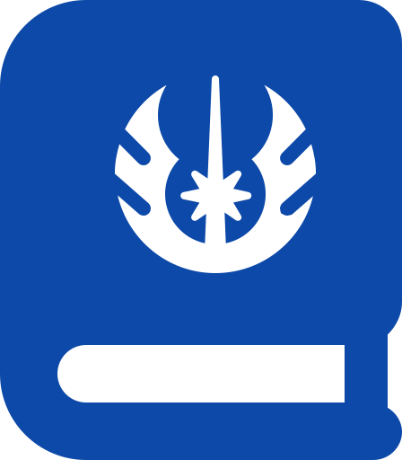

# Star Wars >> Code The Dream pre-work



This project is the pre-work for Code the Dream’s Advanced classes. 
<br>

## Link
To-do: add link to the project hosted on Github

## Table of Contents
- [Installation](#installation)
- [About](#about)
- [Screenshots](#UI)
- [Technologies Used:](#technologies)
- [Status:](#status)

- [To-Do](#todo)


## Installation
### 1. Clone the repo.
```console
$ git clone https://github.com/Bonnyca/StarWars.git
```
### 2. Change into the directory & install dependencies
```console
$ cd StarWars
$ npm install
```
### 3. Run the server:
```console
npm start
```

Runs the app. Navigate your browser to [http://localhost:3000](http://localhost:3000) to access the application.

## About
You can use it as a tiny wiki to refresh your memories regarding things like spaceships lengths of planets' climates.


## Screenshots
### Main Page:

<p>You can navigate to any Star Wars Films from here. </p>


### Movie detailes page:
<p>It displays the number of starships, planets and species filmed in this movie. You can navigate to full lists of Starships, Planets or Species.</p>


### Lists
<p>If there is more then one page, you can navigate using "Previous Page" and "Next Page" buttons.</p>
<P> All numbers dispayed in US-locale format.</p>


## Technologies Used


## Status:
```diff
+ In progress...
```
In progress

## To-Do
- [ ] Add a function to calculate dencity on each planet and display it in the Planets table;
- [ ] Add a parallax effect on the landing page;
- [ ] Add a 404 page
- [ ] Break down into small reusable components


